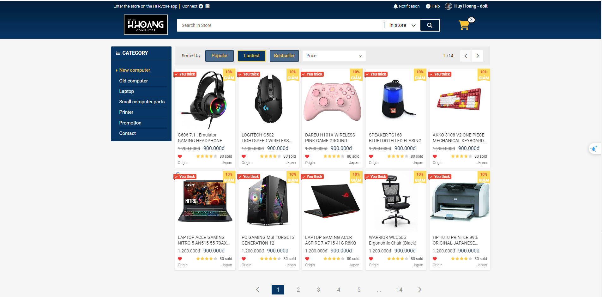
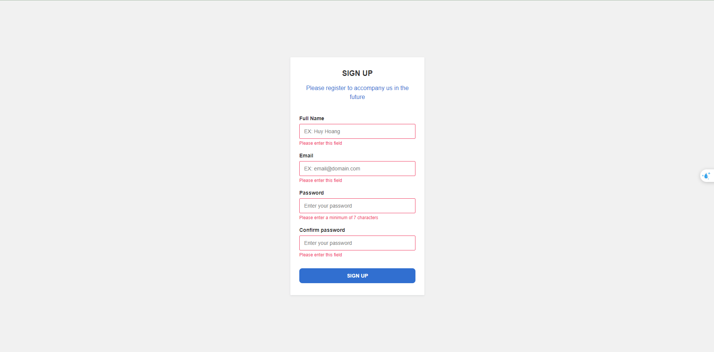

# :raising_hand: User interface library created with HTML/CSS/JS

---

## ⭐ :star: Description

These are the products I made during the process of learning and practicing front end

---

## :wrench: Build with

  

---

## :globe_with_meridians: Link demo

:point_right:[001_BlackPink_page](https://huyhoang-doit.github.io/blackpink_page/) 
&nbsp;
&nbsp;
 
 
:point_right:[002_Electronics_web](https://huyhoang-doit.github.io/electronics_web/) 
&nbsp;
&nbsp;
 
 

:point_right:[003_MusicPlayer](https://huyhoang-doit.github.io/Music_player/) 
&nbsp;
&nbsp;
 
 

:point_right:[004_TodoList](https://huyhoang-doit.github.io/TodoList_using_JavaScript/) 
&nbsp;
&nbsp;
 
 

:point_right:[005_Toast_message](https://huyhoang-doit.github.io/Toast_message/) 
&nbsp;
&nbsp;
 
 

:point_right:[006_Validation_form](https://huyhoang-doit.github.io/Validation_form_js/) 
&nbsp;
&nbsp;
 
 

:point_right:[007_Tab_UI](https://huyhoang-doit.github.io/Tabs_UI/) 
&nbsp;
&nbsp;
 
 

:point_right:[008_Product_card](https://huyhoang-doit.github.io/Product_card/) 
&nbsp;
&nbsp;
 
 

:point_right:[009_Profile_card](https://huyhoang-doit.github.io/Profile_card/) 
&nbsp;
&nbsp;
 
 

:point_right:[010_Simple_search_box](https://huyhoang-doit.github.io/Simple_search_box/) 
&nbsp;
&nbsp;
 
 

:point_right:[011_Simple_modal](https://huyhoang-doit.github.io/Modal_show/) 
&nbsp;
&nbsp;
 
 

:point_right:[012_Image_gallery](https://huyhoang-doit.github.io/Image_gallery/) 
&nbsp;
&nbsp;
 
 

:point_right:[013_Detect_pressed_key](https://huyhoang-doit.github.io/Detect_pressed_key/) 
&nbsp;
&nbsp;
 
 

:point_right:[014_Search_tags](https://huyhoang-doit.github.io/Search_tags/) 
&nbsp;
&nbsp;
 
 

:point_right:[015_Validate_form](https://huyhoang-doit.github.io/Validation_form_simple/) 
&nbsp;
&nbsp;
 
 

:point_right:[016_Weather_app](https://huyhoang-doit.github.io/Weather_app/) 
&nbsp;
&nbsp;
 
 
